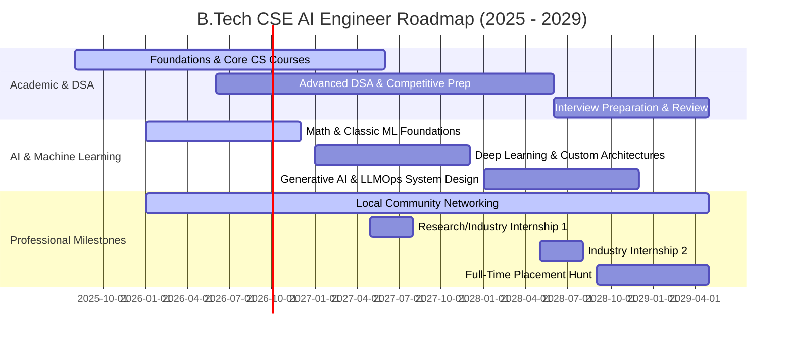

# 2029 Graduation Goals & Milestones

This document sets the high-level roadmap spanning the B.Tech CSE years (2025–2029) at IILM University, Gurgaon.

---

## 📈 High-Level Milestones

---

## 🎓 Year-by-Year Action Plan

### 🔹 Year 2 (Current: Q3 2026 - Q2 2027)
* **Goal:** Master core Machine Learning frameworks (Scikit-Learn, Pandas, NumPy) and foundational algorithms.
* **DSA Target:** Solve 120+ problems focusing on arrays, strings, searching, sorting, and linked lists.
* **Networking:** Start attending Delhi NCR and Gurgaon meetups (PyData, local GDG, AI Saturdays).
* **Internship Focus:** Secure a minor internship/project-based role by the end of Year 2 summer.

### 🔹 Year 3 (Q3 2027 - Q2 2028)
* **Goal:** Pivot to Deep Learning (PyTorch, CNNs, Transformers) and build initial end-to-end applications.
* **DSA Target:** Advance to 200+ problems targeting trees, graphs, heaps, and dynamic programming.
* **Networking:** Build relationships with seniors and NCR startup founders.
* **Internship Focus:** Apply for major software engineering or data science internships in Gurgaon Cyber City.

### 🔹 Year 4 (Q3 2028 - Graduation 2029)
* **Goal:** Master LLM deployment pipelines (LLMOps), advanced RAG, multi-agent systems, and model optimization (quantization, fine-tuning).
* **DSA Target:** Complete 300+ LeetCode problems (Interview ready).
* **Portfolio:** Consolidate past projects into an outstanding public portfolio.
* **Placement:** Target premier product-based startups and major tech companies offering AI/ML Engineer roles.
