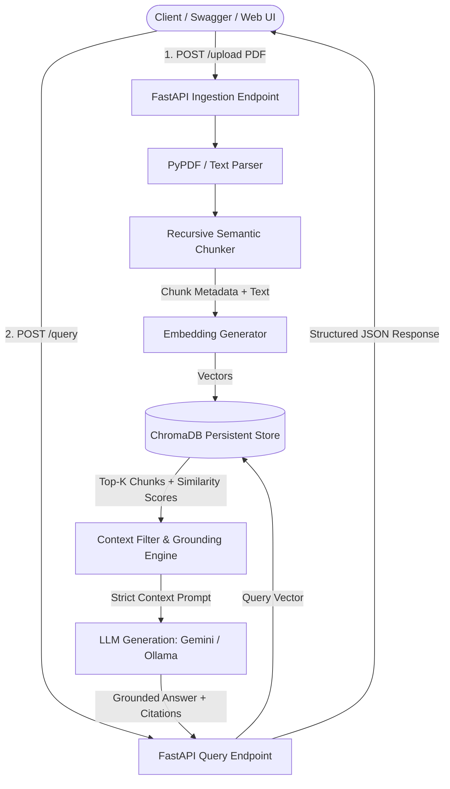

# Project PROJ-03: AxiomDoc RAG Engine (Production Document Intelligence)

> An asynchronous, containerized FastAPI service for high-precision document ingestion, semantic vector retrieval (ChromaDB), and grounded question-answering with verifiable source citations.

* **Project ID:** PROJ-03
* **Repository Target:** `JustKay1029/axiomdoc-rag`
* **Target Delivery:** November 08, 2026 (Live on Render / Hugging Face Spaces)
* **Status:** 🚀 Active Development (Sprint 1)

---

## 🏗️ System Architecture

---

## 🛠️ Architecture Specification

### 1. Data Contract (Pydantic v2 Schemas)
* **`DocumentMetadata`**: Document ID, filename, page count, upload timestamp.
* **`DocumentChunk`**: Chunk ID, document ID, page number, text content, token count.
* **`QueryRequest`**: Query string, top_k (default: 4), score_threshold (default: 0.6).
* **`Citation`**: Source document, page number, excerpt, relevance score.
* **`QueryResponse`**: Grounded answer, citations list, latency ms.

### 2. Endpoints
* `POST /api/v1/documents/upload`: Multipart PDF upload, automated chunking and vector indexing.
* `POST /api/v1/query`: Semantic retrieval and cited LLM completion.
* `GET /api/v1/documents`: List currently indexed documents.
* `DELETE /api/v1/documents/{doc_id}`: Remove document and purge vectors from ChromaDB.
* `GET /health`: Service health and ChromaDB connection check.

---

## 📅 Sprint 1 Milestones
- [x] **Milestone 0 (Oct 10):** Architecture & schemas specification.
- [ ] **Milestone 1 (Oct 11):** Chunking pipeline and Pydantic data models with unit tests.
- [ ] **Milestone 2 (Oct 18):** ChromaDB persistent indexing & semantic similarity search.
- [ ] **Milestone 3 (Oct 25):** Grounded LLM answer generation with citation mapping.
- [ ] **Milestone 4 (Nov 01):** FastAPI endpoints, error handling, and test suite.
- [ ] **Milestone 5 (Nov 08):** Dockerfile, CI GitHub Actions, and live public deployment on Render.
