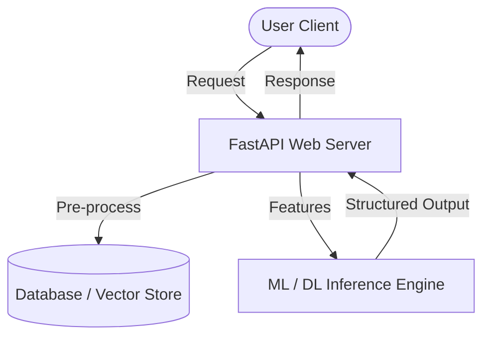

# Project Title: [Name of Project]

> A one-sentence high-impact description of what this system does and who it is for.

---

## 🏗️ System Architecture
*Use a Mermaid diagram or a clean text block to show how data and models flow through your system.*

---

## 📊 Engineering & Evaluation Metrics
*What parameters prove that this project works and is optimized?*

- **Model Metrics:**
  - Accuracy / F1-Score:
  - Loss / Error:
- **System Metrics:**
  - Inference Latency: *[e.g., 45ms average]*
  - Throughput: *[e.g., 50 requests/sec]*
  - Memory Footprint / Docker Size:
- **Financial/Token Metrics (If LLM-based):**
  - Avg. Token Cost per Request:

---

## 🛠️ Stack & Dependencies
* **Inference/Modeling:**
* **Serving/API:**
* **Storage/Caching:**
* **Infrastructure/LLMOps:**

---

## 📈 Key Engineering Challenges & Solutions
1. **Challenge 1:** *Explain a concrete technical blocker you hit (e.g., overfitting, slow database queries, parsing errors).*
   - **Resolution:** *How did you debug it? What code or structural changes did you make?*
2. **Challenge 2:**
   - **Resolution:**

---

## 💡 Lessons Learned & Trade-offs
* What structural changes would you make if you had to rebuild this system from scratch?
* What are the trade-offs between precision, speed, and cost in this architecture?
